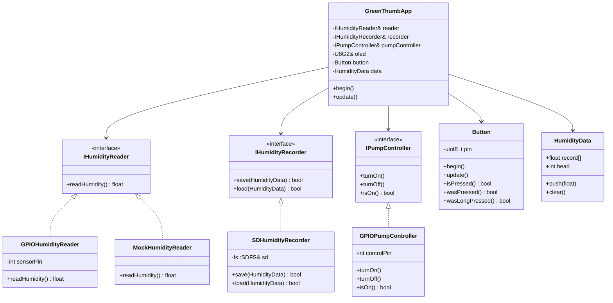

# GreenThumb


GreenThumb は、Seeed XIAO ESP32C3 を使用したインテリジェントな自動水やり・土壌湿度監視システムです。
土壌の湿度を常時監視し、乾燥状態に応じて自動的にポンプを作動させて水やりを行います。また、OLEDディスプレイによる情報の可視化や、SDカードへのデータロギング機能も備えています。

## 機能

*   **リアルタイム湿度監視**: 土壌湿度センサーを使用して、現在の湿度をリアルタイムに計測します。
*   **自動給水制御**: 湿度が設定された閾値（デフォルト 5.0%）を下回ると自動的にポンプを作動させ、十分な湿度（デフォルト 75.0%）になるまで給水します。
*   **情報表示**: OLEDディスプレイ (SSD1306) に現在の湿度値と、過去の湿度変化を示すグラフを表示します。
*   **データロギング**: 計測した湿度データをSDカードに記録し、電源を切ってもデータを保持します。
*   **ユーザー操作**: ボタン操作により、システムの状態確認やデータの明示的なリセット（長押し）が可能です。

## ハードウェア構成

*   **マイコンボード**: Seeed XIAO ESP32C3
*   **ディスプレイ**: SSD1306 OLED (I2C接続)
*   **センサー**: アナログ土壌湿度センサー
*   **アクチュエータ**: 水中ポンプ (MOSFET等で駆動)
*   **ストレージ**: SDカードモジュール (SPI接続)
*   **入力**: プッシュボタン

### ピン配置 (デフォルト設定)

| デバイス | ピン | 備考 |
| :--- | :--- | ---: |
| 土壌湿度センサー | D0 | アナログ入力 |
| ユーザーボタン | D1 | 入力 (Pull-up) |
| SDカード CS | D2 | SPI Chip Select |
| ポンプ制御 | D3 | デジタル出力 |
| OLED SDA | D4 | I2C SDA |
| OLED SCL | D5 | I2C SCL |

## ソフトウェア設計

本プロジェクトは、疎結合でテスト容易性を考慮したオブジェクト指向設計を採用しています。主要なコンポーネントはインターフェースを介して接続されており、ハードウェアの変更やモックへの差し替えが容易です。
（テストは一切書いてないけどな！）

### クラス図



## 開発環境

*   **IDE**: VS Code + PlatformIO
*   **Framework**: Arduino
*   **Platform**: Espressif 32

### 依存ライブラリ

*   `olikraus/U8g2`: OLEDディスプレイ制御用

## 動作のカスタマイズ

システムの動作をカスタマイズしたい場合は、以下のファイルを編集してください。

### 1. ピン配置の変更 (`src/main.cpp`)

デフォルトのピン配置を変更する場合、`main.cpp` の以下の定数を編集します。

```cpp
constexpr uint8_t SENSOR_PIN = D0;       // 湿度センサーのアナログピン
constexpr uint8_t SD_CS_PIN = D2;        // SDカードモジュールのCSピン
constexpr uint8_t PUMP_CONTROL_PIN = D3; // ポンプ制御用GPIOピン
```

> [!WARNING]
> ボタンピンとI2Cピン（OLED用）の変更は `src/greenthumb_app.h` と `src/main.cpp` の両方の編集が必要です。

### 2. 水やりの閾値調整 (`src/greenthumb_app.h`)

土壌の種類や植物の好みに応じて、水やりの開始・停止閾値を変更できます。

```cpp
constexpr static float PUMP_ON_THRESHOLD = 5.0f;   // ポンプを作動させる湿度閾値 (%)
constexpr static float PUMP_OFF_THRESHOLD = 75.0f; // ポンプを停止させる湿度閾値 (%)
```

*   `PUMP_ON_THRESHOLD`: この値を下回るとポンプが作動します（より乾燥を検知）
*   `PUMP_OFF_THRESHOLD`: この値以上になるとポンプが停止します（十分に湿った状態）

### 3. データ記録・表示間隔の変更 (`src/greenthumb_app.h`)

データの記録頻度やディスプレイの更新頻度を変更できます。

```cpp
constexpr static uint32_t RECORD_INTERVAL = 5 * 60 * 1000; // データ記録間隔（5分）
constexpr static uint32_t DISPLAY_INTERVAL = 2000;         // ディスプレイ更新間隔（2秒）
```

*   `RECORD_INTERVAL`: SDカードへのデータ記録間隔（ミリ秒）
    *   例: `10 * 60 * 1000` = 10分ごと
    *   例: `60 * 1000` = 1分ごと
*   `DISPLAY_INTERVAL`: OLEDディスプレイの更新間隔（ミリ秒）
    *   例: `1000` = 1秒ごと
    *   例: `5000` = 5秒ごと

> [!WARNING]
> `RECORD_INTERVAL` を短くしすぎるとSDカードの寿命が短くなる可能性があります。

### 4. カスタマイズ後のビルド手順

1.  上記のファイルを編集します
2.  変更を保存します
3.  以下のコマンドでビルドします
    ```bash
    platformio run
    ```
4.  デバイスを接続し、以下のコマンドで書き込みます
    ```bash
    platformio run --target upload
    ```

### 5. センサーキャリブレーション（高度な設定）

お使いの土壌湿度センサーによって、出力値のキャリブレーションが必要な場合があります。センサーの読み取り処理は `src/humidity_reader.h` の `GPIOHumidityReader` クラスに実装されています。必要に応じてアナログ値から湿度パーセントへの変換ロジックを調整してください。

## ビルドと実行

1.  リポジトリをクローンします。
2.  VS Code でプロジェクトフォルダを開きます。
3.  PlatformIO が依存ライブラリを自動的にインストールするのを待ちます。
4.  以下のコマンドでビルドします。
    ```bash
    platformio run
    ```
5.  デバイスを接続し、以下のコマンドで書き込みます。
    ```bash
    platformio run --target upload
    ```
> [!WARNING]
> モーターはリレーとかMOSFET経由で接続してください！多分動作しないかマイコンが壊れます！
